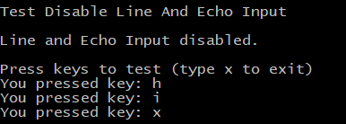

# ansi-terminal-native [](https://travis-ci.org/weissreto/ansi-terminal-native)

Provides classes that allows to modify terminal modes for Windows and Linux.

## Enable ANSI escape sequences in the windows console

Enable virtual terminal processing in Windows 10. This allows to use ANSI escape sequences in the windows console. ANSI escape sequences can be used 
to change the text color, the background color, move the cursor around, clear the screen, etc.  

```java
boolean enabled = AnsiTerminalForWindows.enableVirtualTerminalProcessing();
if (enabled)
{
  System.out.println("\033[31m This text should be in red !!!! \033[0m");
}
else
{
  System.err.println("Virtual Terminal Mode not support!");
}
```


## Disable line and echo input

By default line and echo input is enabled for Java. Therefore an application can only read a whole line at once from standard IN after the user entered the line and pressed ENTER.
Disabling the line and echo input allows an application to read single characters individual from standard IN (Linux, Windows). 

```java
boolean disabled = AnsiTerminalForLinux.disableLineAndEchoInput();
if (disabled)
{
  System.out.println("Line and Echo Input disabled.");
  System.out.println();
  System.out.println("Press keys to test (type x to exit)");
  char ch;
  do
  {
    ch = (char)System.in.read();
    System.out.println("You pressed key: "+ch);
  } while (ch != 'x');
}
else
{
  System.err.println("Line and Echo Input not disabled!");
}
```



## Change code page of Windows console to UTF-8 (Windows)

Change the code page of the Windows console to UTF-8 so that non ASCII characters can be printed to the console.

```java
boolean enabled = AnsiTerminalForWindows.changeToUtf8CodePage();
if (enabled)
{
  System.out.println("Utf8 Code Page enabled");
  System.out.println();
  System.out.println("Special characters: \u0100  \u0101");
}
else
{
  System.err.println("Utf8 Code Page not enabled!");
}
```

